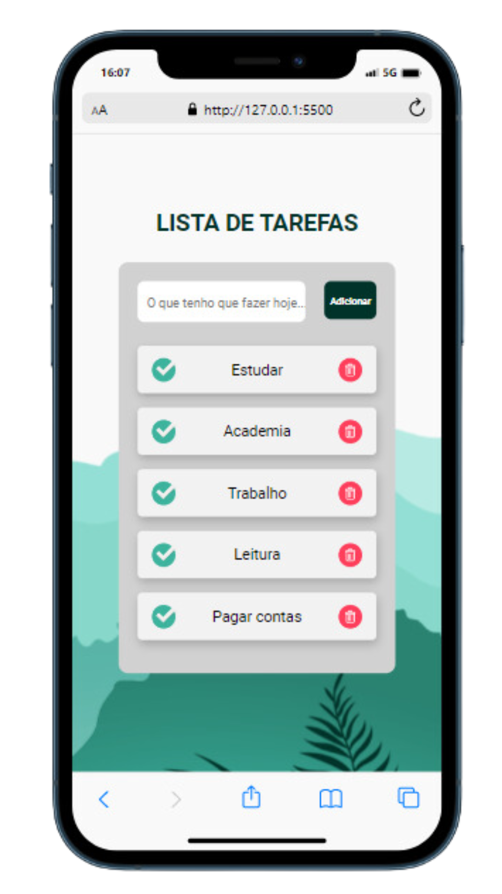

<h1> Projeto To-do List <h1/>
  
 <h3> Este é um projeto para aprofundar habilidades como HTML, CSS e principalmente JavaScript <h3/>
   
   <h3> Neste projeto utilizei as seguintes tecnologias: </h3>

 
 
 
 

   
  <h3> Link do Projeto </h3> 
 <a  href="https://projeto-to-do-list.netlify.app/"> Projeto To-do List</a>     
   
 
 
